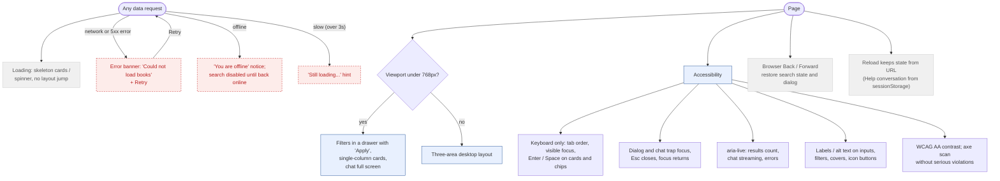

# 7. Common States, Responsiveness & Accessibility

Cross-cutting behaviour for every section of the page.

```mermaid
flowchart TD
  any(["Any data request"]) --> loading["Loading: skeleton cards /<br/>spinner, no layout jump"]
  any -->|"network or 5xx error"| banner["Error banner: 'Could not load books'<br/>+ Retry"]
  banner -->|"Retry"| any
  any -->|"offline"| offline["'You are offline' notice;<br/>search disabled until back online"]
  any -->|"slow (over 3s)"| slowMsg["'Still loading...' hint"]

  page(["Page"]) --> mobile{"Viewport under 768px?"}
  mobile -->|"yes"| mLayout["Filters in a drawer with 'Apply',<br/>single-column cards,<br/>chat full screen"]
  mobile -->|"no"| dLayout["Three-area desktop layout"]

  page --> a11y["Accessibility"]
  a11y --> keys["Keyboard only: tab order, visible focus,<br/>Enter / Space on cards and chips"]
  a11y --> trap["Dialog and chat trap focus,<br/>Esc closes, focus returns"]
  a11y --> live["aria-live: results count,<br/>chat streaming, errors"]
  a11y --> labels["Labels / alt text on inputs,<br/>filters, covers, icon buttons"]
  a11y --> contrast["WCAG AA contrast; axe scan<br/>without serious violations"]

  page --> history["Browser Back / Forward<br/>restore search state and dialog"]
  page --> reload["Reload keeps state from URL<br/>(Help conversation from sessionStorage)"]

  classDef screen fill:#e8f0fe,stroke:#2f5d9e
  classDef hidden fill:#fdecea,stroke:#c62828,stroke-dasharray:4 3,color:#b71c1c
  classDef internal fill:#f0f0f0,stroke:#cfcfcf,color:#555555
  class mLayout,dLayout,a11y screen
  class banner,offline,slowMsg hidden
  class loading,history,reload internal

  %% guide 01-getting-started.md
```
